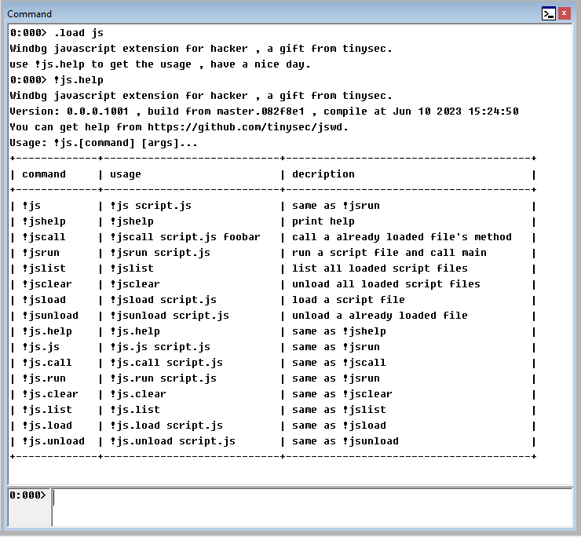

# jswd

Windbg javascript extension for hacker , a gift from tinysec.

Powered by [JSEX](https://github.com/tinysec/jsex) project.

## usage

1. download right arch version of zipped jswd file from github release.

2. decompress and put the 'js.dll' into same arch version windbg's extension dir.

3. load the jswd by `.load js`

4. have a nice day.
